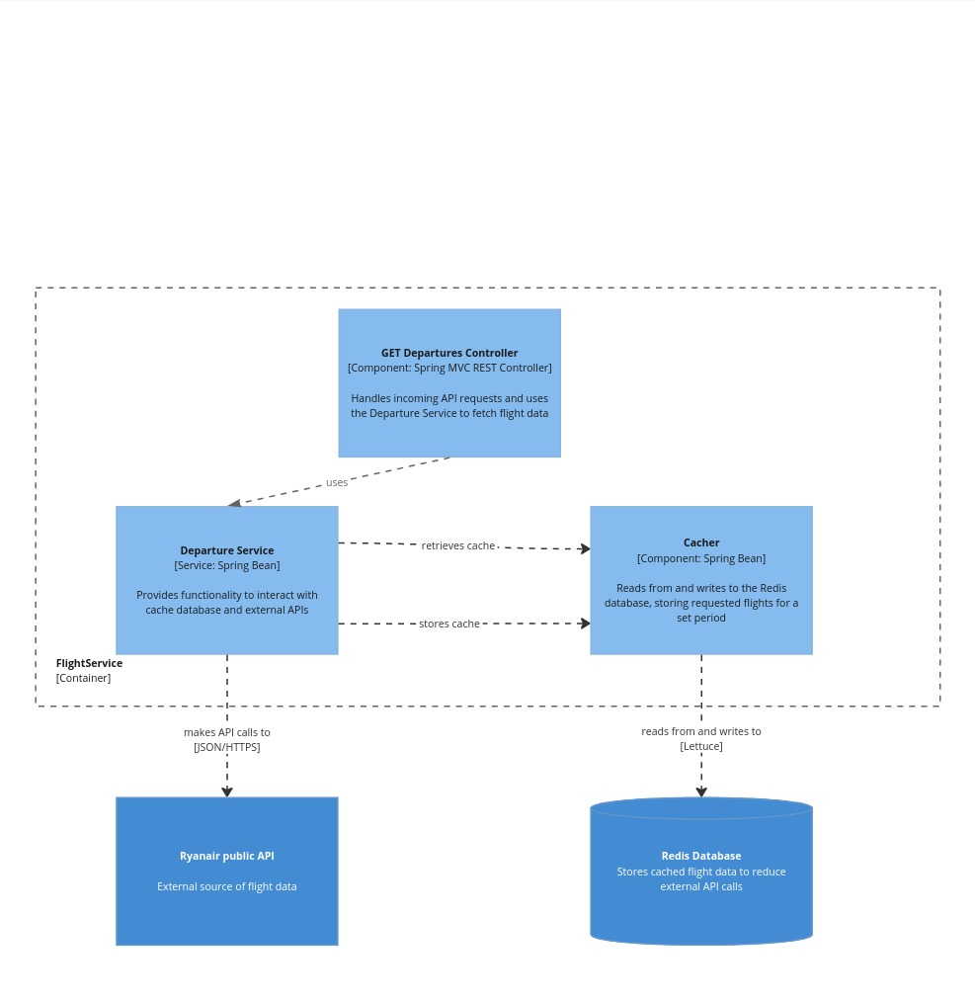

# TakeFlights microservice 

## Introduction
The 'TakeFlight' microservice is part of a larger project to find "Chained trip" between two airports.

## Purpose overview 
The microservice retrieves flights from external APIs and stores it to its own Redis database as cache. The main idea of
creating separated microservice is to isolate communication with external API and storing the received data as cache to
avoid exceeding rate-limits of external APIs. 

## Technologies used
- Java
- Spring Boot
- Redis
- Gradle

## Architecture diagram


## Endpoints
### Get cheapest flights
#### URL 
'GET /flights'
#### Description
Retrieves the cheapest flight fares from a specified origin on a given departure date. Optionally filters results to 
include only flights within the Schengen Area.
#### Parameters
| Name          | Type    | Required | Default | Description                                                    |
|---------------|---------|----------|---------|----------------------------------------------------------------|
| `origin`      | String  | Yes      | None    | The IATA code of the departure airport.                        |
| `departure_at`| String  | Yes      | None    | The date of departure in the format `yyyy-MM-dd`.              |
| `schengenOnly`| Boolean | No       | false   | If `true`, only includes flights within the Schengen Area.     |
#### Responses 
- **200 OK**
    - **Description**: Successfully retrieved the flight data.
      - **Body**:
          ```json
              [
                {
                  "flightNumber": "string (IATA airline designator followed by numeric identifier)",
                  "departureAt": "ISO 8601 date-time",
                  "originAirportName": "string",
                  "originAirportCode": "IATA code",
                  "originCountryCode": "ISO 3166 country code",
                  "destinationAirportName": "string",
                  "destinationAirportCode": "IATA code",
                  "destinationCountryCode": "ISO 3166 country code",
                  "price": "double",
                  "currencyCode": "ISO 4217 currency code"
                },
                ...
              ]
        ```

- **204 No Content**
    - **Description**: No flights found for the given criteria.
    - **Body**: `null`

- **400 Bad Request**
    - **Description**: Missing or invalid parameters.
    - **Body**: `null`

- **500 Internal Server Error**
    - **Description**: An unexpected error occurred on the server.
    - **Body**: `null`

#### Example Request

```bash
curl -X GET "http://localhost:60000/flights?origin=JFK&departure_at=2024-07-20&schengenOnly=true"
```
#### Example successful response
```json
    [
      {
        "flightNumber": "FR35",
        "departureAt": "2024-07-21T21:25:00",
        "originAirportName": "Bratislava",
        "originAirportCode": "BTS",
        "originCountryCode": "sk",
        "destinationAirportName": "Manchester",
        "destinationAirportCode": "MAN",
        "destinationCountryCode": "gb",
        "price": 68.52,
        "currencyCode": "EUR"
      },
      {
        "flightNumber": "FR8227",
        "departureAt": "2024-07-21T05:45:00",
        "originAirportName": "Bratislava",
        "originAirportCode": "BTS",
        "originCountryCode": "sk",
        "destinationAirportName": "Alghero",
        "destinationAirportCode": "AHO",
        "destinationCountryCode": "it",
        "price": 69.91,
        "currencyCode": "EUR"
      },
      {
        "flightNumber": "FR4225",
        "departureAt": "2024-07-21T14:45:00",
        "originAirportName": "Bratislava",
        "originAirportCode": "BTS",
        "originCountryCode": "sk",
        "destinationAirportName": "Rome Ciampino",
        "destinationAirportCode": "CIA",
        "destinationCountryCode": "it",
        "price": 70.09,
        "currencyCode": "EUR"
      },
      {
        "flightNumber": "FR62",
        "departureAt": "2024-07-21T05:45:00",
        "originAirportName": "Bratislava",
        "originAirportCode": "BTS",
        "originCountryCode": "sk",
        "destinationAirportName": "London Stansted",
        "destinationAirportCode": "STN",
        "destinationCountryCode": "gb",
        "price": 85.09,
        "currencyCode": "EUR"
      },
      {
        "flightNumber": "FR4643",
        "departureAt": "2024-07-21T10:25:00",
        "originAirportName": "Bratislava",
        "originAirportCode": "BTS",
        "originCountryCode": "sk",
        "destinationAirportName": "Milan Bergamo",
        "destinationAirportCode": "BGY",
        "destinationCountryCode": "it",
        "price": 97.99,
        "currencyCode": "EUR"
      }
    ]
```
## How to run
### Prerequisites 
- Java 21
- Gradle
- Redis server

### Run script
```bash
#!/bin/bash
# Clone the repository
git clone https://github.com/xbiletskyi/TakeFlights
cd TakeFlights

# Build the Docker image
docker build -t takeflights:latest .

# Run Redis container
docker run -d -p 6379:6379 --name redis redis

# Run the TakeFlights container
docker run -d -p 60000:8080 --name takeflights --link redis:redis -e REDIS_HOST=redis -e REDIS_PORT=6379 takeflights:latest

# Display running containers
docker ps
```
